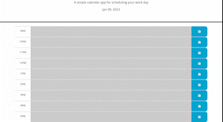

# Work Day Scheduler

## Technology Used

| Technology Used         | Resource URL           | 
| ------------- |:-------------:| 
| HTML    | [https://developer.mozilla.org/en-US/docs/Web/HTML](https://developer.mozilla.org/en-US/docs/Web/HTML) | 
| CSS     | [https://developer.mozilla.org/en-US/docs/Web/CSS](https://developer.mozilla.org/en-US/docs/Web/CSS)      |   
| Git | [https://git-scm.com/](https://git-scm.com/)     |   
| Bootstrap | [https://getbootstrap.com/docs/5.1/getting-started/introduction/](bootstrap.com)|

## Description 

[Click here for Deployed Site](https://megellman.github.io/work-day-scheduler/)

I created a workday scheduler where a user can input content to each hourly time block. When they refresh the page, the content will remain. Additionally, when the page is loaded, hour blocks from 9am to 5pm are shown. Each hour block is either gray (if in the past), green (if present), or red if in the future.



## Table of Contents

* [Work Day Scheduler Code Example](#work-day-scheduler-code-example)
* [Learning Points](#learning-points)
* [Author Info](#author-info)
* [Credits](#credits)
* [License](#license)

## Work Day Scheduler Code Example

To update the color of each div based on whether it is in the past, present, or future, I used an if else statement. By converting the current hour to a number, I can compare it to the hour in the time block div and update the color accordingly.

```
now = Number((dayjs().format('H')));

         if (hour.attr('id') < now) {
                timeBlockDiv.removeClass('future present');
                timeBlockDiv.addClass('past');
            } else if (hour.attr('id') > now) {
                timeBlockDiv.removeClass('past present');
                timeBlockDiv.addClass('future');
            } else {
                timeBlockDiv.removeClass('past future');
                timeBlockDiv.addClass('present');
            }
```

## Learning Points

I learned a lot about local storage by doing this project. Each hour block content is saved to local storage according to the time it's associated with. Additionally, local storage of the same key will override the original value. 

Another thing I learned from this project was how to create elements and id's for those elements so that I could later iterate through them to change content or apply attributes. I found the best method was to apply id's with a corresponding number so that each, for example, fourth item (div, h1, etc) could be iterated through within the same for loop. 

## Author Info

### Megan Ellman

[LinkedIn](https://www.linkedin.com/in/megan-ellman/)

[GitHub](https://github.com/megellman)

[Portfolio](https://megellman.github.io/portfolio/)

## Credits 

|Resource | Link |
|-------|:-------:|
|On Click Events | [api.jquery.com](https://api.jquery.com/on/#on-events-selector-data-handler) |
| Local Storage   | [developer.mozilla.org](https://developer.mozilla.org/en-US/docs/Web/API/Window/localStorage) |


## License

MIT License

Copyright (c) [2023] [Megan Ellman]

Permission is hereby granted, free of charge, to any person obtaining a copy
of this software and associated documentation files (the "Software"), to deal
in the Software without restriction, including without limitation the rights
to use, copy, modify, merge, publish, distribute, sublicense, and/or sell
copies of the Software, and to permit persons to whom the Software is
furnished to do so, subject to the following conditions:

The above copyright notice and this permission notice shall be included in all
copies or substantial portions of the Software.

THE SOFTWARE IS PROVIDED "AS IS", WITHOUT WARRANTY OF ANY KIND, EXPRESS OR
IMPLIED, INCLUDING BUT NOT LIMITED TO THE WARRANTIES OF MERCHANTABILITY,
FITNESS FOR A PARTICULAR PURPOSE AND NONINFRINGEMENT. IN NO EVENT SHALL THE
AUTHORS OR COPYRIGHT HOLDERS BE LIABLE FOR ANY CLAIM, DAMAGES OR OTHER
LIABILITY, WHETHER IN AN ACTION OF CONTRACT, TORT OR OTHERWISE, ARISING FROM,
OUT OF OR IN CONNECTION WITH THE SOFTWARE OR THE USE OR OTHER DEALINGS IN THE
SOFTWARE.